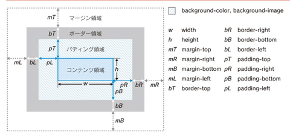

  

フレックス  
[回り込み](回り込み/index.md)  

[\
](div.md)  

[マージン](マージン.md)  
[パディング](パディング.md)  
[コンテンツ](コンテンツ.md)  

[ボックス](ボックス.md)  
[ブロックボックス](ブロックボックス.md)  
[インラインボックス](インラインボックス.md)  
[ブロックとインラインを変更](ブロックとインラインを変更.md)  
